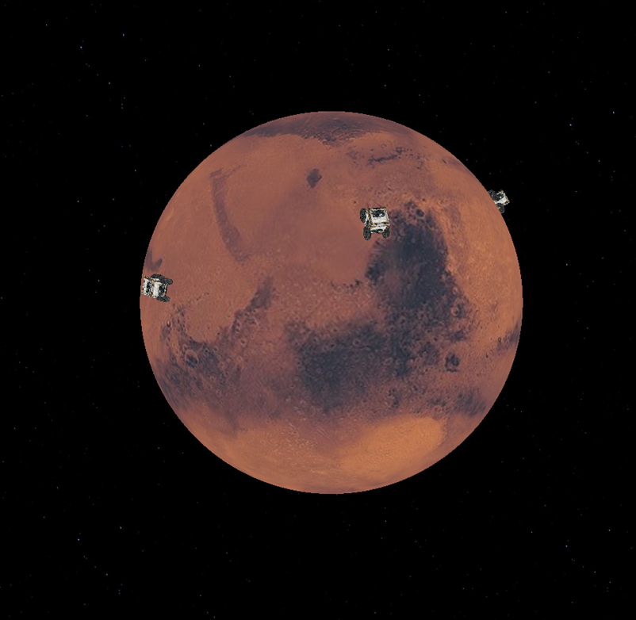

# CS-405-Computer-Graphics-Mars-Game

Game includes a render of mars and rovers. One rover can be controlled with WASD. Camera can be controlled with direction keys and RF, to move in 3D space.
Pressing C changes camera perspective.

Game stops when user controlled rover collides with another rover

